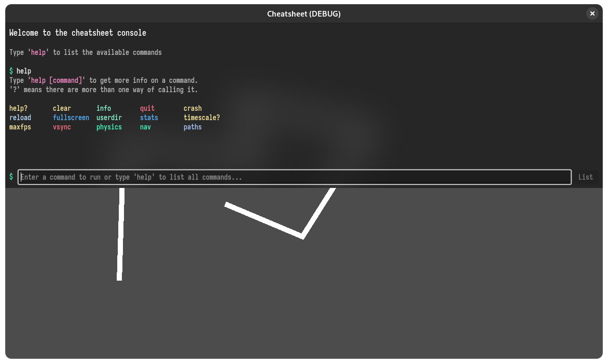

# Cheatsheet
A debug console for your Godot game.



## Features
- [x] Debug console with text based input.
- [x] Adding custom commands with arguments.
- [x] A help menu that lists all of the available commands and how to use them.
- [x] History!
- [x] An overlay to show performance stats.
- [x] Some kinda neat looking animations?

### Things on the roadmap
- [ ] A controller friendly command palette with inputs.
- [ ] More QoL updates.

## How to...
### ...add custom commands
```gdscript
# register a command called 'echo' that executes a callable
Console.register('echo',
	func(text: String):
		Console.println('%s... %s...' % [text, text.to_lower()]
).arg('text', TYPE_STRING)\ # add an argument to this command
	.info('echo a string of text in a creepy way...')
```
> The `\` at the end of `arg` allows for us to continue calling functions on a new line.

The `echo` command is called like so:
```shell
$ echo Testing123
$ echo '...Or if you\'re wanting to have spaces.'
```
> Sorry for the strange sentence. I wanted to demonstrate how to escape `'`s.

### ...change the key to toggle the console
Open the `cheatsheet.tscn` in `res://addons/cheatsheet/` and edit the `toggle_shortcut` property to whatever you want.

## Links
[Godot Asset Library Listing](https://encrypted-tbn0.gstatic.com/images?q=tbn:ANd9GcQ6Ei3mVwUpVlEpS9ImQ8TfhzvWrtwLVeaL-g&usqp=CAU) | [Github Repo](https://github.com/CiberTurtle/godot-cheatsheet) | [Issue Tracker](https://github.com/CiberTurtle/godot-cheatsheet/issues)
